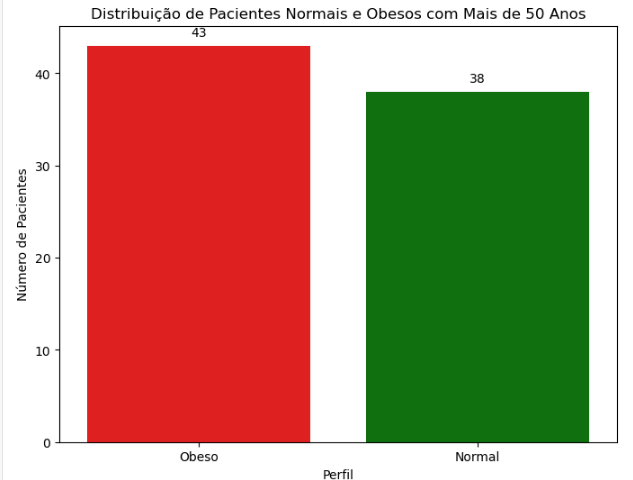

# Estudo de caso diabetes | Pima Indians Diabetes Database
Neste projeto de análise de dados foi preciso gerar uma amostra de dados com os pacientes com mais de 50 anos e para cada um deles indicar em uma nova coluna se o paciente está normal (índice de massa corpórea menor que 30) ou obeso (índice de massa corpórea maior ou igual a 30). Então, gerar um novo arquivo CSV e encaminhar para o Cientista de Dados. O problema foi resolvido com a criação de um Banco de Dados, Python e SQL. 
Os dados foram inicialmente carregados com Python, então uma cópia dos dados foi enviada para o banco de dados e utilizamos SQL para as transformações necessárias. Por fim, copiamos os dados transformados de volta para um dataframe do Pandas para salvar o resultado em formato CSV.

### Database referência:
https://www.kaggle.com/datasets/uciml/pima-indians-diabetes-database

  

